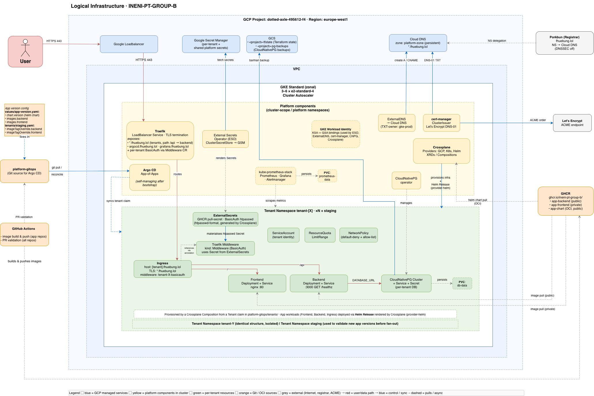

# platform

Entry point for the **INENI-PT-GROUP-B** course project: an on-demand,
multi-tenant SaaS platform on Google Kubernetes Engine for the
*Infrastructure Engineering* course at Hochschule Burgenland (summer
term 2026). This repository carries the cross-cutting documentation,
the contribution rules, and the AI-usage disclosure that apply to all
six repositories of the project.

## Architecture at a glance

One Day-1 bootstrap script (`platform-iac/bootstrap/bootstrap.sh`)
provisions VPC, GKE Standard zonal, the platform's GSAs and Workload
Identity, and Argo CD. From there Argo CD reconciles every Day-2
component out of `platform-gitops`, and Crossplane fans each tenant
claim out into namespace, NetworkPolicies, ResourceQuota,
CloudNativePG Postgres cluster, BasicAuth chain, and a Helm release
of the tenant app. Day-1 and Day-2 each have their own flow diagram
alongside the static view above — see [`docs/architecture/`](docs/architecture/).

## The six repositories

| Repo | What it holds |
| --- | --- |
| [`platform`](https://github.com/INENI-PT-GROUP-B/platform) | This repo — cross-cutting documentation, `CONTRIBUTING.md`, architecture diagrams, cost planning, presentation, AI-usage log. |
| [`platform-iac`](https://github.com/INENI-PT-GROUP-B/platform-iac) | Terraform + `bootstrap.sh` for Day-1 (VPC, GKE, IAM, Workload Identity, Argo CD). |
| [`platform-gitops`](https://github.com/INENI-PT-GROUP-B/platform-gitops) | The single source of truth Argo CD reconciles from: Applications, Crossplane XRDs / Compositions, ESO stores, tenant claims. |
| [`app-backend`](https://github.com/INENI-PT-GROUP-B/app-backend) | Property-management API (Node 22 / Fastify / Postgres) and the shared Helm chart used for every tenant. |
| [`app-frontend`](https://github.com/INENI-PT-GROUP-B/app-frontend) | Property-management UI. **Private** — the only private repo, per the assignment requirement. |
| [`.github`](https://github.com/INENI-PT-GROUP-B/.github) | Org-wide GitHub defaults: issue / PR templates, reusable CI workflows, label set. |

The six repos are cloned as siblings into a single workspace — the
layout each team member sets up locally is described in
[`docs/setup/`](docs/setup/).

## Quickstart

End-to-end from a cold local checkout to a live tenant URL. Each step
links into the repo that owns the detail; do not copy commands out of
sequence.

1. **Clone the workspace.** Six sibling clones plus a workspace-level
   Claude context file. Follow [`docs/setup/`](docs/setup/) for the
   exact layout and the `CLAUDE.md` template.
2. **Run the Day-1 bootstrap.** In `platform-iac`, copy
   `bootstrap/bootstrap.env.example` to `bootstrap/bootstrap.env`,
   fill in the GCP project / region / zone, satisfy the operator IAM
   prerequisites, then run `./bootstrap/bootstrap.sh`. Single command,
   idempotent, no further manual clicks. Full prereqs and phase
   breakdown:
   [`platform-iac/README.md`](https://github.com/INENI-PT-GROUP-B/platform-iac#bootstrap-order).
3. **Onboard a tenant.** In `platform-gitops`, drop a 7-line
   `Tenant` claim under `tenants/`, open a PR, squash-merge. Argo CD
   syncs, Crossplane reconciles, the tenant is live at
   `<name>.fhuebung.lol` within minutes. End-to-end runbook:
   [`platform-gitops/docs/tenant-onboarding.md`](https://github.com/INENI-PT-GROUP-B/platform-gitops/blob/main/docs/tenant-onboarding.md).

## Documentation hub

- **Architecture:** [`docs/architecture/`](docs/architecture/) —
  static logical view, Day-1 bootstrap flow, Day-2 tenant
  provisioning flow, with a written reading guide alongside the
  diagrams.
- **Cost planning:** [`docs/cost-planning/capacity_costs_gcp.md`](docs/cost-planning/capacity_costs_gcp.md)
  for the plan, [`docs/cost-planning/actuals_costs_gcp.md`](docs/cost-planning/actuals_costs_gcp.md)
  for actuals against the granted budget.
- **Presentation:** [`docs/presentation/slides-outline.md`](docs/presentation/slides-outline.md)
  — the working outline for the 20-minute final presentation.
- **Contribution rules:** [`CONTRIBUTING.md`](CONTRIBUTING.md) — the
  canonical version for the whole organization (branch naming, commit
  format, PR flow, security).
- **AI usage disclosure:** [`AI_USAGE.md`](AI_USAGE.md) — reverse-
  chronological log of significant AI uses across the project, per
  the course assignment.
- **Shared Claude context:** [`docs/claude/`](docs/claude/) — the
  files Claude Code loads automatically on every session via the
  workspace-level `CLAUDE.md` (see `docs/setup/`).
- **Task backlog:** [`tasks/task-list.md`](tasks/task-list.md) — the
  sprint-tracked task list with deadlines and owners.

## Contributing

[`CONTRIBUTING.md`](CONTRIBUTING.md) in this repo is the **canonical
version** for the entire organization — the other five repos defer to
it. Key rules:

- No direct commits to `main`. All changes go through pull requests.
- Conventional Commits + squash merge. Linear history, no merge
  commits.
- Every PR references an issue.

## Security

All repositories in the org are **public** except `app-frontend`.
Treat everything as world-readable: no plaintext secrets, no hard-
coded credentials, no example values that resemble real ones. Secrets
are sourced exclusively from Google Secret Manager via External
Secrets Operator; in-cluster workloads use GKE Workload Identity.

At project end, actual spend will be compared against the granted
budget in the cost-planning folder, alongside a short lessons-learned
note.
